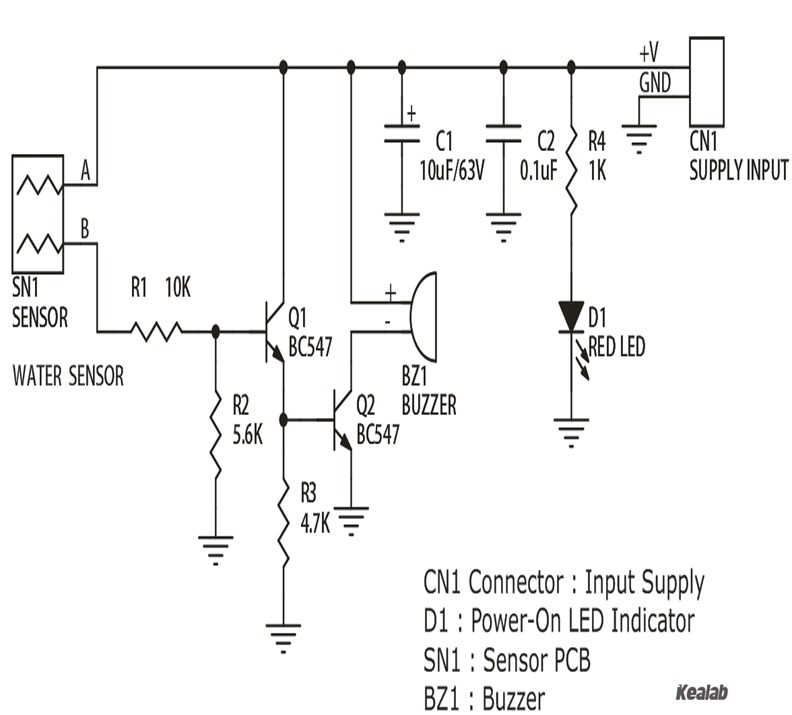
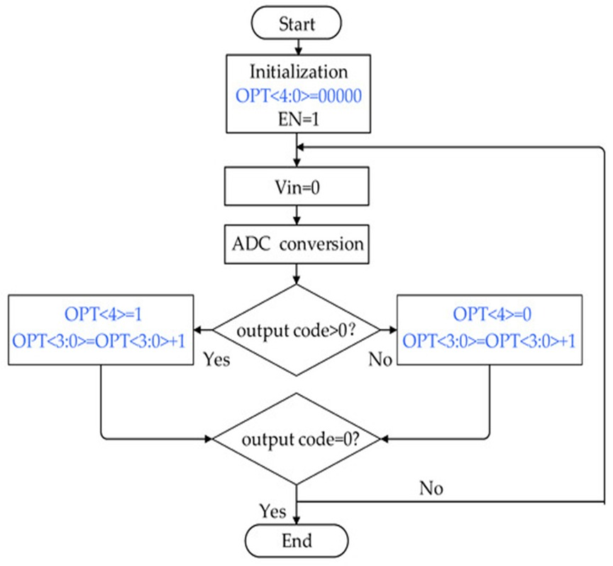
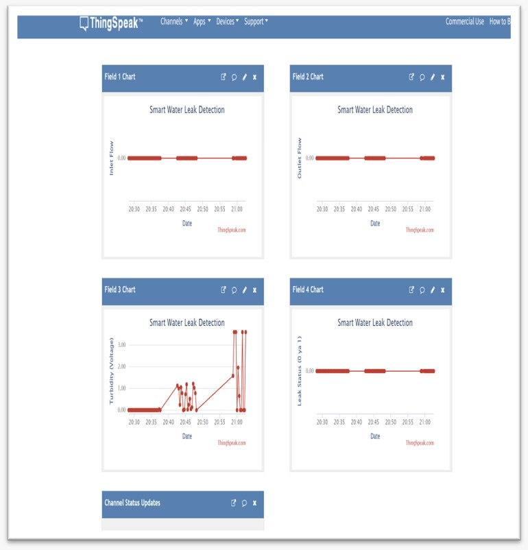

# Smart-Water-Monitoring-IoT
Raspberry Pi based real-time water quality monitoring. Detected viscosity changes using Turbidity &amp; Flow sensors. Cloud integration with Think Speak for live data visualization.
## Project Abstract
This project introduces a smart water monitoring system using Raspberry Pi to tackle water conservation. Beyond just clear water, we analyze "Grey Water" containing detergents. 

By using flow sensors and the continuity equation (Q=AV), the system can differentiate between a natural change in flow and a hidden leakage, making it a sustainable and cost-effective choice for modern water management.
### 🌍 Introduction & Global Motivation

*The project addresses the critical global water scarcity crisis using advanced engineering and smart sensor infrastructure.*

### 🏗️ System Architecture & Logic Flow

  
  

*Left: Block diagram of the end-to-end integration (Sensors -> Microcontroller -> ThingSpeak Cloud -> User).*
*Right: The core algorithmic roadmap used for decision-making and flow calculation.*

### ⚙️ Electrical System Design

*Detailed schematic of the sensor interfacing circuit.*
### 📸 Project Visuals

#### 1. Hardware Prototype Setup

*ESP 32 connected with Turbidity and Flow sensors for real-time monitoring.*

#### 2. Cloud Analytics Dashboard (ThinkSpeak)

*Real-time data visualization showing flow rates and turbidity levels.*

### 🛠️ Technical Details
- **Microcontroller:** Raspberry Pi / ESP32
- **Language:** MicroPython
- **Key Concepts:** Fluid Pathology, IoT Cloud Sync, $Q = A \times V$ Continuity Equation.

### 💻 Source Code
The complete implementation logic for sensor data acquisition and cloud syncing can be found here: [main.py](./main.py)

- ### 🚀 How to Use
1. Clone this repository.
2. Update the `WIFI_SSID` and `THINGSPEAK_API_KEY` in `main.py`.
3. Upload the code to your Raspberry Pi/ESP32 using Thonny IDE.
4. Monitor live data on your ThinkSpeak dashboard.

### 📚 Future Scope
- Integration of Machine Learning to predict leakage patterns.
- Mobile app alerts for immediate valve shut-off.
